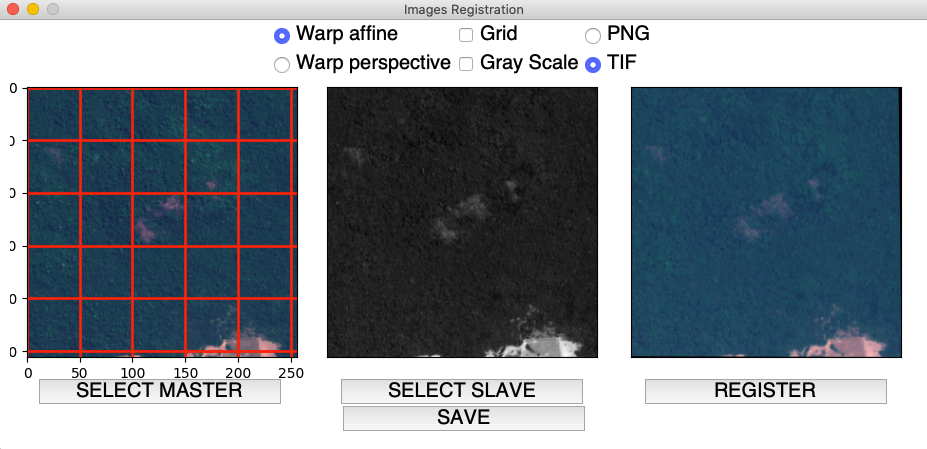

# Images registation tool for Earth Observation applications
###### Author: Alessandro Sebastianelli, alessandro.sebastianelli1995@gmail.com

## Status
- [X] GUI
- [X] Load Images
- [X] Registration
- [X] Extra features (grid, grayscale)
- [X] Save the result

## Dependencies
#### I do recommend to use a virtualenv
Python version 3.6.8

- Open CV:
  - pip install opencv-python==3.4.2.16
  - pip install opencv-contrib-python==3.4.2.16
- Tkinter
- Matplotlib
- Numpy
- Rasterio
- Pillow

## Tutorial

The tool has been developed to be very easy to use.

- First row
	- Warp affine or warp perspective: are two registration method (select your favorite)
	- Grid: activate a grid when an image is loaded, it can be used to verify the registration
	- Grayscale: turns the plot into a grayscale version when an image is loaded
	- PNG and TIF: choose the save format

- Second row: preview of images
- Third row: loading and registration button
- Last row: save button

##### The repo folder contains two Sentinel-2 images for testing the tool.